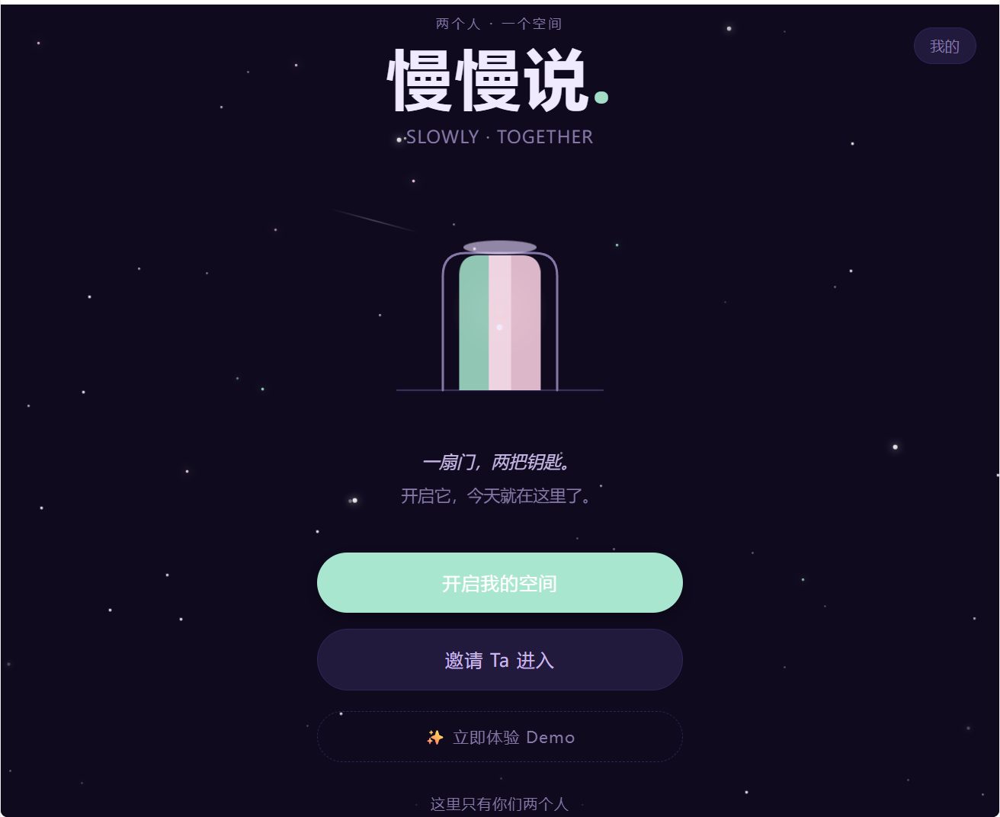
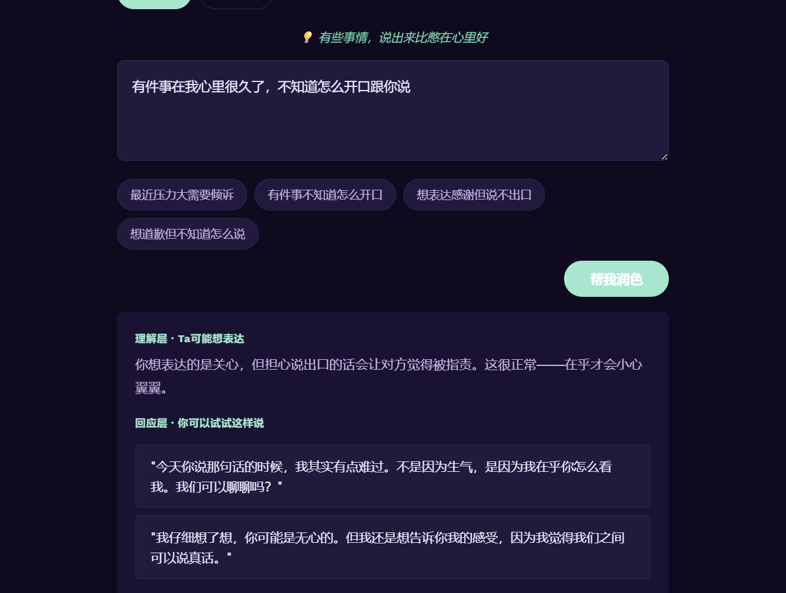
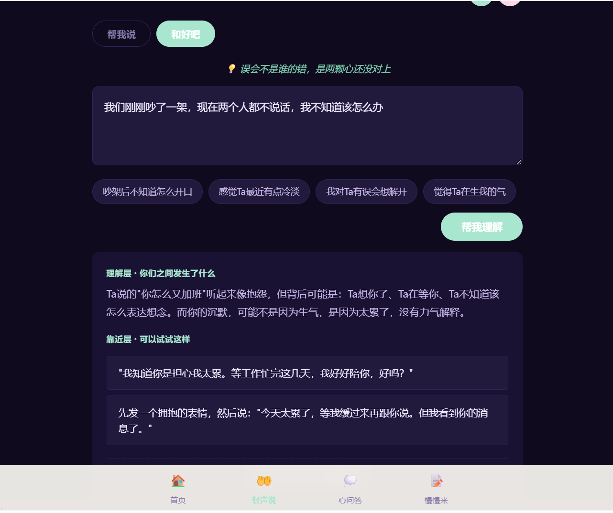
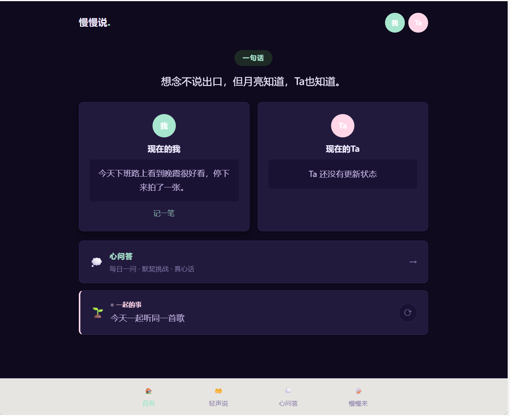
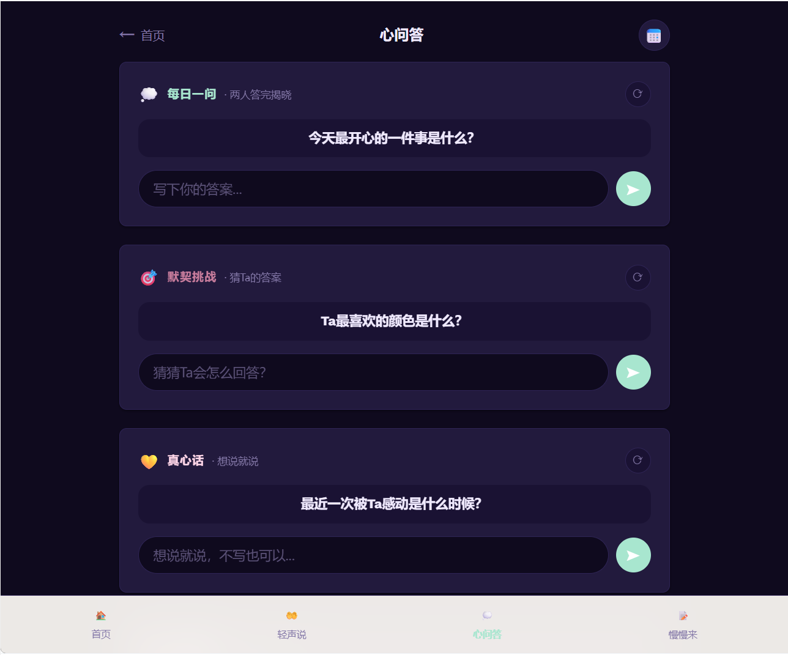
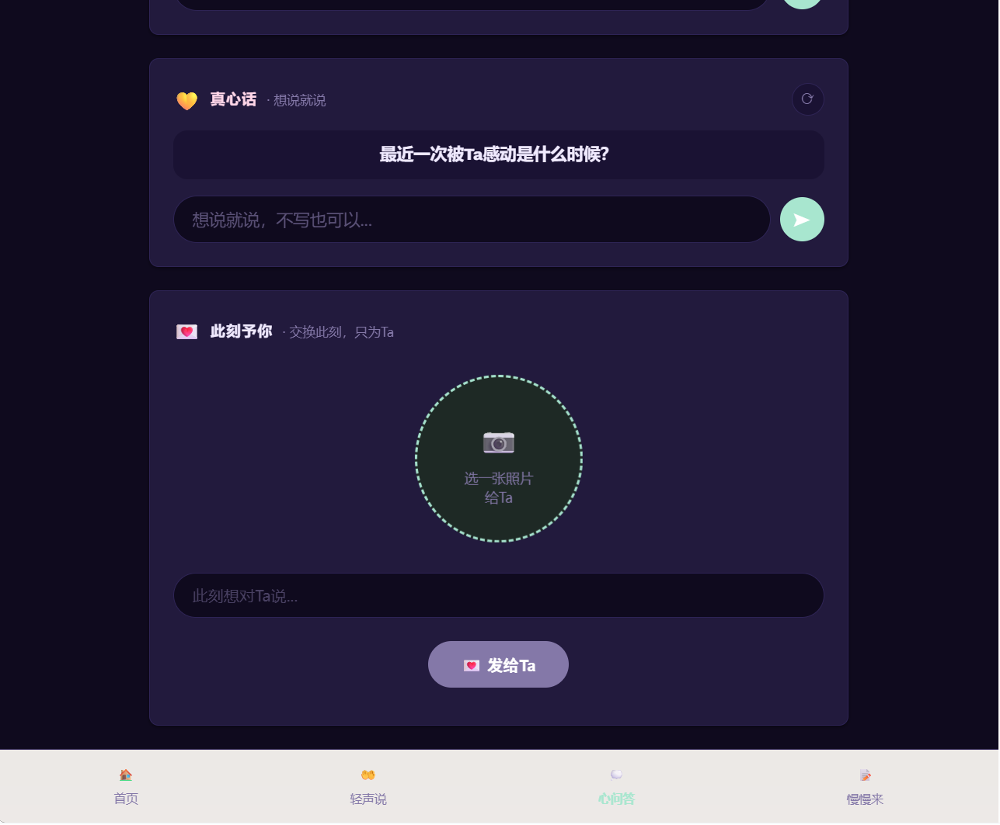

# 【生活娱乐赛道】慢慢说 · AI 帮你把说不出口的话，变成对方愿意听的话

> 标签：`生活娱乐`
> 本作品由 TRAE IDE 辅助开发完成，已接入美团 LongCat-2.0 大模型。

---

## 1. Demo 简介

**一句话**：慢慢说是一个为两个人打造的轻量级 H5 互动空间。手机浏览器打开即用，无需安装 App。两个人各持一把"钥匙"（房间码），进入同一个专属空间，通过每日引导式互动，慢慢靠近彼此。

**面向谁**：处于亲密关系中的两个人——情侣、夫妻、异地伴侣、密友。尤其是那些因为日常忙碌而沟通变少，又不想让感情变淡的人。

**核心记忆点**：

> **AI 帮你把难以说出口的话，变成对方愿意听进去的话。**

很多人不是不爱了，是"不知道怎么说"。明明心里在意，开口却变成了指责；明明想和解，话到嘴边又咽回去。慢慢说的「帮你说」和「帮你懂」两个功能，用 AI 把那些卡在喉咙里的话，翻译成对方能接收的版本。

**核心功能**：

| 功能 | 说明 |
|------|------|
| 🤲 **帮你说** | 输入"想说但说不出口"的话，AI（美团 LongCat-2.0）帮你理解真正想表达什么，并润色成对方愿意听的版本，还能选温柔/直接/俏皮三种语气 |
| 🤲 **帮你懂** | 描述一段关系困惑，AI 帮你从对方视角看一眼，并给 2 条可以真的发出去的话术 |
| 🌤 微光状态 | 各自记录今天的一个心情瞬间，对方可见，不需要回应。低压力的存在感 |
| 💭 每日一问 | 每天一个问题，55 题库分 5 类轮换，引导双方表达 |
| 🎯 默契挑战 | 互相猜对方的答案，揭晓后看看你们有多默契 |
| 💬 真心话 | 一个安全的地方，说出平时不好意思说的话 |
| 💖 此刻予你 | 每天一个拍照主题，互相分享一张"此刻"的照片 |

**界面预览**（以下为产品真实页面截图）：

<!-- 截图1：首页 -->

*首页：深紫星空 + 门扉动画，"开启我的空间"创建房间*

<!-- 截图2：帮你说 AI -->

*帮你说：输入"你最近都不怎么理我"，龙猫 AI 生成理解层 + 转化层 + 三种语气*

<!-- 截图3：帮你懂 AI -->

*帮你懂：描述冲突场景，AI 解读对方视角 + 给出可发出去的话术*

<!-- 截图4：微光状态 -->

*微光状态：现在的我 + 现在的Ta，各自的心情瞬间*

<!-- 截图5：每日一问 -->

*每日一问：双方回答双向可见*

<!-- 截图6：此刻予你 -->

*此刻予你：今天的拍照主题 + 双方照片*

---

## 2. Demo 创作思路

**灵感来源**：

这个想法来自一个很真实的观察：很多情侣并不是不爱了，而是"没时间好好说话"。白天各自忙碌，晚上累到只想刷手机，明明躺在床上却像隔着银河。日常沟通变成了"吃了没""早点睡"这种功能性对话，感情慢慢就淡了。

更难的是那些"想说但说不出口"的话——"你那句话让我很难过""我想你但怕打扰你""我知道我错了但不知道怎么开口"。这些话憋在心里变成隔阂，说出来又怕变成吵架。

所以我想做两件事：
1. **给两个人留一个轻量的专属空间**，用每日引导让沟通不只在"吃了没"
2. **用 AI 帮人把卡住的话翻译出来**，不是替你说，是帮你说

**想解决的问题**：

- **沟通变浅**：日常对话只剩功能性的"吃了没"，缺少有温度的表达
- **话卡在喉咙**：想表达感受，但怕说出口变成指责，最后选择沉默
- **读不懂对方**：对方的一句话，自己理解成了另一个意思，误会越积越深
- **异地更难**：见不到面时，需要一个能感受到"对方在"的方式

**几个关键判断**：

1. **轻量优于功能堆砌**——H5 即开即用，比 App 门槛低 10 倍
2. **引导式优于自由式**——给一个问题，比"随便聊"更容易开口
3. **异步优于实时**——不要求同时在线，各自有空就记一笔，对方自然看见
4. **AI 翻译而非 AI 替代**——AI 帮你把情绪翻译成语言，不替你做关系决策

**关于 AI 的边界**：

我接入的是美团 LongCat-2.0（龙猫）大模型，但刻意限制了它的角色：
- **能做**：帮用户把情绪转化为具体的、可被对方接收的表达；从对方视角解读一段关系困惑
- **不能做**：不评判谁对谁错、不劝分不劝和、不脑补对方的具体反应、不输出说教和鸡汤

AI 不是站在两人中间的第三者，是站在你身后帮你组织语言的朋友。

---

## 3. Demo 体验方式

### 主交付：HTML zip（离线可用，双击即玩）

**下载：** [manmanshuo-demo.zip](上传后替换为社区附件链接)（1.1 MB）

**体验方法：**
1. 下载并解压 zip 文件
2. 双击打开 `index.html`（手机或电脑浏览器均可）
3. 点击首页的「✨ 立即体验 Demo」按钮
4. 进入翻页书演示：6 页精简版，包含帮你说/帮你懂完整交互 + 其他功能预览

> zip 是纯前端离线包，双击即用。帮你说/帮你懂在离线时用本地 mock 数据展示效果；完整功能（含真实 AI、房间创建、双向同步）需后端运行。

### 完整功能（开发者自测）

```bash
git clone https://github.com/hakfir924-gif/czlds
cd czlds && npm install

# 配置 AI（可选，不配则用本地 mock）
echo "LONGCAT_API_KEY=你的key" > .env
# key 获取：https://longcat.chat/platform/api_keys（公测期每日 500 万 tokens 免费）

bash start.sh   # 启动后端
python -m http.server 8080   # 启动前端
# 浏览器访问 http://localhost:8080
```

---

## 4. TRAE 实践过程

本项目全程使用 **TRAE IDE** 开发，AI 辅助完成了从架构设计到功能实现到调试修复的全流程。

### 关键步骤 1：项目架构与后端搭建

用 TRAE IDE 搭建了 Node.js + Express 后端，设计了房间数据结构、双 Token 鉴权机制（房间 Token + 用户认证 Token）、JSON 文件存储方案。AI 帮助生成了 CORS 中间件、Multer 图片上传配置、数据持久化逻辑。

**Session ID：** `3964165657740396:04cc5bb0cd875c9ec673d9dcc465886a_6a381a906e4b9e6c40849e94.6a4cc45d6a8d1e818f46cd9f.6a4cc45d3cc73c09866e26fe:TRAE Work CN.0.1.34.no_sid.no_ppe.T(2026/7/7 17:26:26)`

### 关键步骤 2：前端页面与「星夜呢喃」主题

用 TRAE IDE 生成首页、心问答、轻声说等 11 个前端页面。AI 根据描述的"温暖、私密、夜间使用"的调性，设计了一套「星夜呢喃」深紫星空主题（深紫底 #0f0a1e + 薄荷绿主强调 #a8e6cf + 樱花粉副强调 #ffd6e8），并统一应用到全站。过程中 AI 还主动提出了门扉动画、呼吸光晕、流星等细节。

**Session ID：** `3964165657740396:08f0764fb66e4ffaf8031516c2625a84_6a381a906e4b9e6c40849e94.6a3889c090b47168655c0ca7.6a3889bda107b73ddade1025:TRAE Work CN.0.1.34.no_sid.no_ppe.T(2026/6/22 09:04:57)`

### 关键步骤 3：接入美团 LongCat-2.0 真实大模型

这是整个项目最关键的一步。用 TRAE IDE 接入了美团 LongCat-2.0（龙猫）大模型，实现了「帮你说」和「帮你懂」两个核心 AI 功能：

- **帮你说**：用户输入一段"想说但说不出口"的话 → AI 返回理解层（解读真正想表达什么）+ 转化层（润色成对方愿意听的版本）+ 三种语气变体（温柔/直接/俏皮）
- **帮你懂**：用户描述一段关系困惑 → AI 返回理解层（从对方视角看这件事）+ 2 条可以真的发出去的话术

技术上：龙猫 API 兼容 OpenAI 格式，通过 `https://api.longcat.chat/openai/v1/chat/completions` 调用。关键设计是 system prompt 里明确写了"能做/不能做/怎么说"三条规范——AI 不评判对错、不劝分劝和、不脑补对方反应、不输出 AI 套话。前端做了降级：探测到后端 AI 可用就调真实大模型，否则用本地 mock 保证离线也能演示。

**Session ID：** `3964165657740396:3f41dc5504adfc1cbad55158e19b3dd2_6a381a906e4b9e6c40849e94.6a38929990b47168655c0e62.6a3892980e177ec53a17c5e5:TRAE Work CN.0.1.34.no_sid.no_ppe.T(2026/6/22 09:42:29)`

### 关键步骤 4：用户系统与个人中心

用 TRAE IDE 实现了完整的用户认证系统：注册/登录/改资料/改密码/登出，9 个 API 接口。设计了双 Token 机制——房间 Token（8 位字符）用于房间访问，用户认证 Token（`tk_`+36 位 hex，30 天有效）用于登录态，两者完全分离避免冲突。

### 关键步骤 5：演示 Demo 与离线降级

为了大赛评审，用 TRAE IDE 设计了完整的 Demo 方案：
- 6 页 CSS 3D 翻页书（perspective + rotateY 真实翻页 + 书脊/书签/页角微卷）
- 帮你说/帮你懂各自在一页内完成输入 → 场景预设 → AI 生成 → 三层结果
- 第 5 页 5 个功能卡片可点击预览（微光/每日一问/默契挑战/此刻予你/月度回顾）
- 一键打包脚本生成符合大赛要求的 HTML zip

---

## 5. 技术栈

| 层 | 技术 |
|----|------|
| 前端 | 纯 HTML + CSS + JavaScript（无框架），「星夜呢喃」深紫星空主题 |
| 后端 | Node.js + Express，端口 3000 |
| 存储 | JSON 文件存储（`data/` 目录） |
| 图片上传 | Multer，最大 5MB |
| 鉴权 | 双 Token 机制（房间 Token + 用户认证 Token） |
| 密码安全 | SHA-256 + Salt 哈希 |
| **AI** | **美团 LongCat-2.0（龙猫）大模型，OpenAI 兼容格式** |

---

## 6. 开发心得

用 TRAE IDE 开发这个项目，最大的感受是**"想到就能做到"**。几个印象深刻的地方：

1. **AI 会主动提建议**：我说"做个情侣互动 H5"，AI 主动提出了门扉动画、深色主题、双 Token 机制等设计，比我预想的更完整
2. **AI 接入有讲究**：接龙猫时，真正难的不是 API 调用，而是怎么写 system prompt 让 AI"有边界地说话"——不评判、不劝分、不说教。这部分和 AI 反复调了几轮
3. **边做边 commit**：有一次环境重置导致代码丢失，AI 立刻提醒我"做完一块就 git commit"，之后再也没有丢过
4. **离线降级思维**：Demo 要给评委离线体验，但 AI 又必须真实。最后用"前端探测后端 + 失败降级 mock"解决，评委双击就能玩，截图里看到的是真 AI

这个项目让我相信，**好的工具不是替你思考，而是帮你说出心里已经有但说不出来的东西**。慢慢说这个产品本身也是这个理念——AI 不替你表达，而是帮你表达。

---

## 报名帖链接

[【生活娱乐赛道】「慢慢说」— 两个人的小空间](https://forum.trae.cn/t/topic/35862)

---

*本作品由 TRAE IDE 辅助开发，全部代码已开源：https://github.com/hakfir924-gif/czlds*
